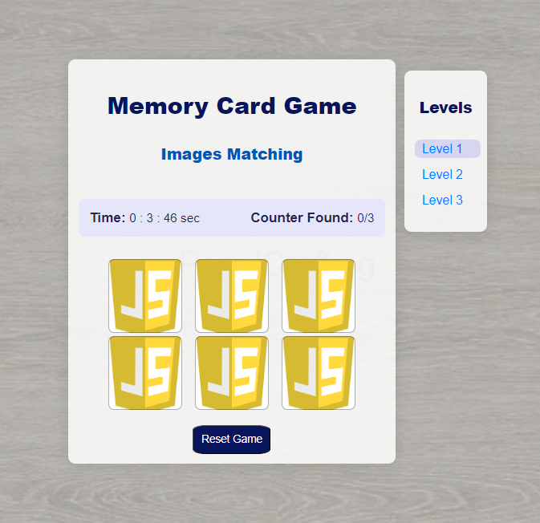
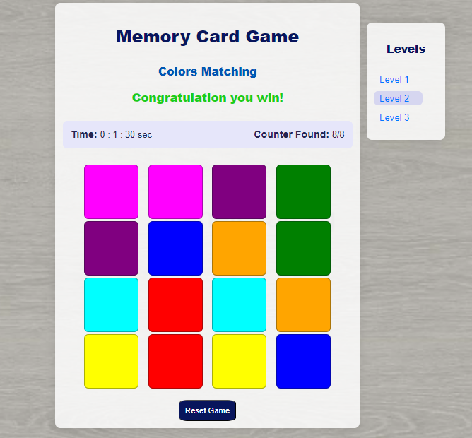
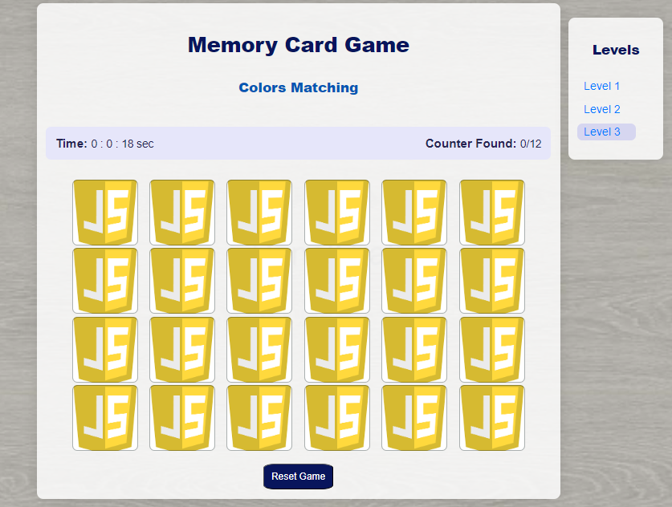

# Memory Cards Game
## Date: 12/09/2024
## By: Hussain Jaffer Aliwi
####  [GitHub](https://github.com/H-aliwi/) | [Linkedln](https://www.linkedin.com) 

***
### ***_Description_***
#### **In this project, I will do a Memory Cards game using HTML, CSS, and JavaScript. The game will contain three levels.** 
***

### ***_Technologies Used_***
* HTML
* CSS 
* Java Script (DOM) 
***

### ***Memory Card Game Images***
<!-- ##### Sign up and sign in as a new user and then begin viewing the different sections of the website.
##### A Trello board was used to keep track of development progress and can be viewed [here](https://getnave.com/blog/trello-kanban-boards).
##### The project was deployed and can be viewed [here](https://www.namecheap.com/market). -->

***

***

### ***_Future Updates_***
- [ ] Adding flip anmation.

***
### ***_Credits_***
##### Images: [GeeksforGeeks](https://www.geeksforgeeks.org).
##### Markdown Guide: [javatpoint](https://www.javatpoint.com/software-engineering-incremental-model).
##### Markdown Cheatsheet: [Poster](https://plagiarismdetector.net).
***